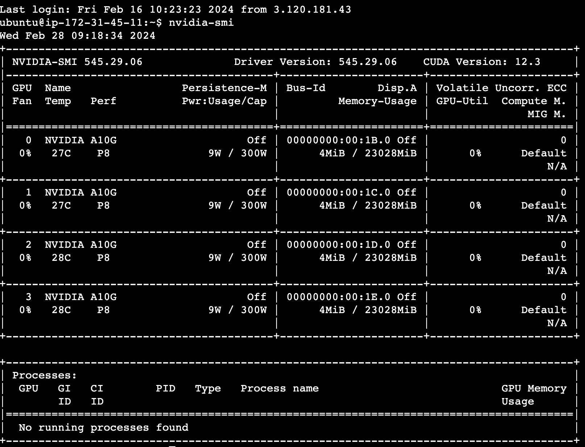
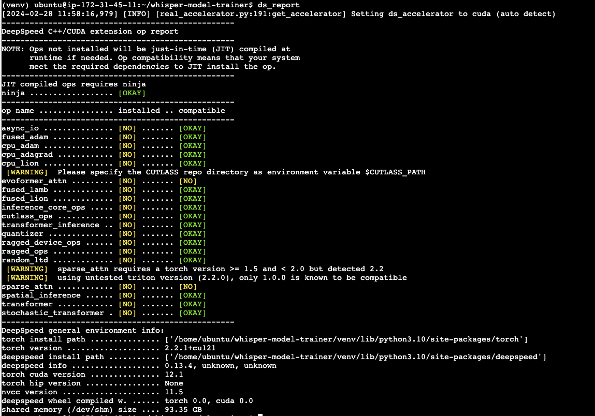
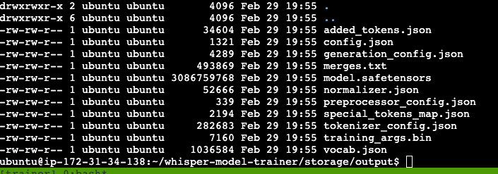

# Fine-Tune Whisper (trainer)
 
**Runtime we're using:**

- AWS EC2 instance type: **g5.12xlarge**
- Canonical, **Ubuntu, 22.04 LTS**, amd64 jammy image build on 2024-02-07



**That's how we're preparing AWS EC2 instance:**

```bash
echo "[1] UPDATING"

sudo apt-get update -y
sudo apt-get upgrade -y

echo "[2] ADDING/ENABLING ADDITIONAL REPOS"

sudo apt-get install gcc clang cmake procps nano python3-pip python3-dev git git-lfs ffmpeg libaio-dev

echo "[3] DEV PREREQUISITES"

pip3 install setuptools pip wheel mpi4py -U
git lfs install

echo "[4] NVIDIA"

# https://www.cherryservers.com/blog/install-cuda-ubuntu

sudo apt-get install ubuntu-drivers-common
sudo apt-get install nvidia-driver-545

sudo reboot
```

after restart:

```bash
echo "[1] DEEPSPEED"

pip3 install deepspeed -U

ds_report

echo "[2] NVIDIA-CUDA-TOOLKIT"

wget https://developer.download.nvidia.com/compute/cuda/repos/ubuntu2204/x86_64/cuda-keyring_1.1-1_all.deb
sudo dpkg -i cuda-keyring_1.1-1_all.deb

sudo apt-get update -y
sudo apt-get upgrade -y

sudo apt install cuda-toolkit

ds_report
```



**We identified that we need to update ~/.bashrc with:**

https://developer.nvidia.com/blog/accelerating-ai-training-with-tf32-tensor-cores/

*Disables all TF32 kernels from being used so that FP32 kernels will be used:*

```bash
NVIDIA_TF32_OVERRIDE=0
```

**That's how we're launching DeepSpeed:**

```bash
deepspeed --num_gpus 4 main.py
```

**Problem we are trying to solve:**

The training process starts and runs, but the model size is too small. By running the same script on our local setup, we can see that the model size is ~6 GB (more or less same as openai/large-v2), but running on AWS we get just half the size model.

We need to identify problem and fix it. We need to get the same output as on a local setup.



